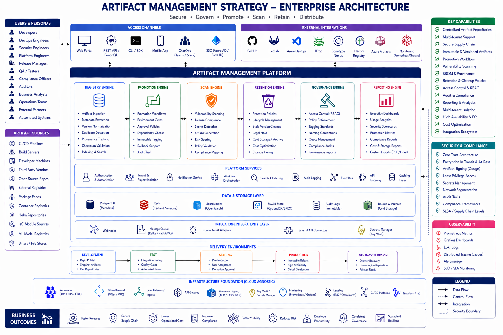
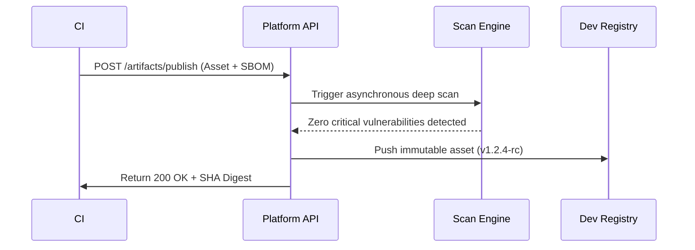
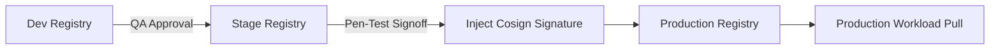
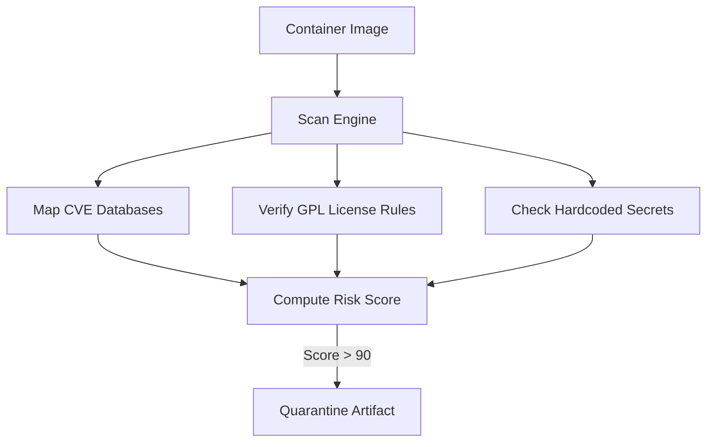
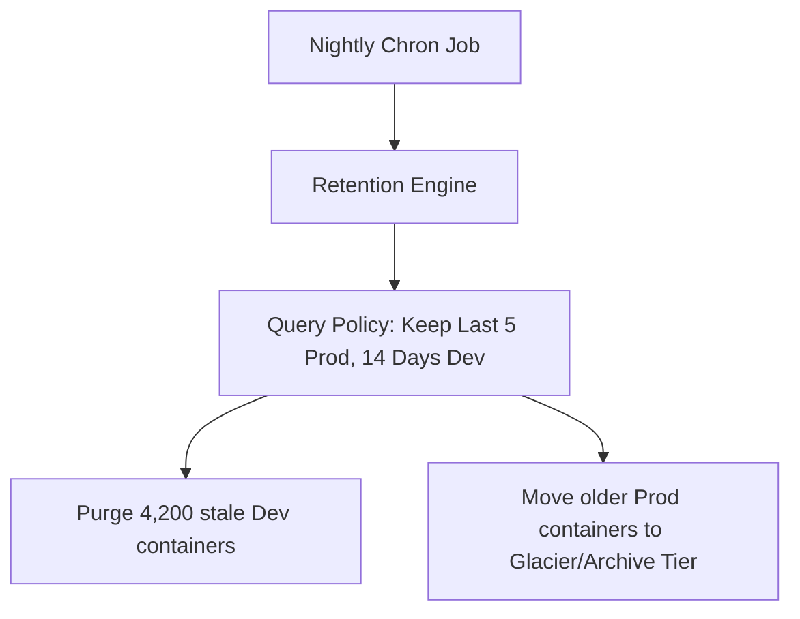
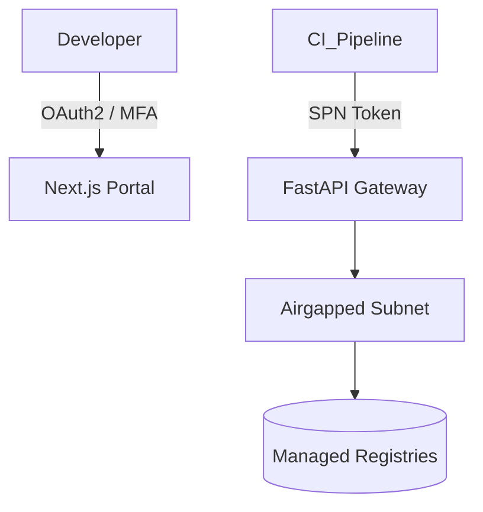
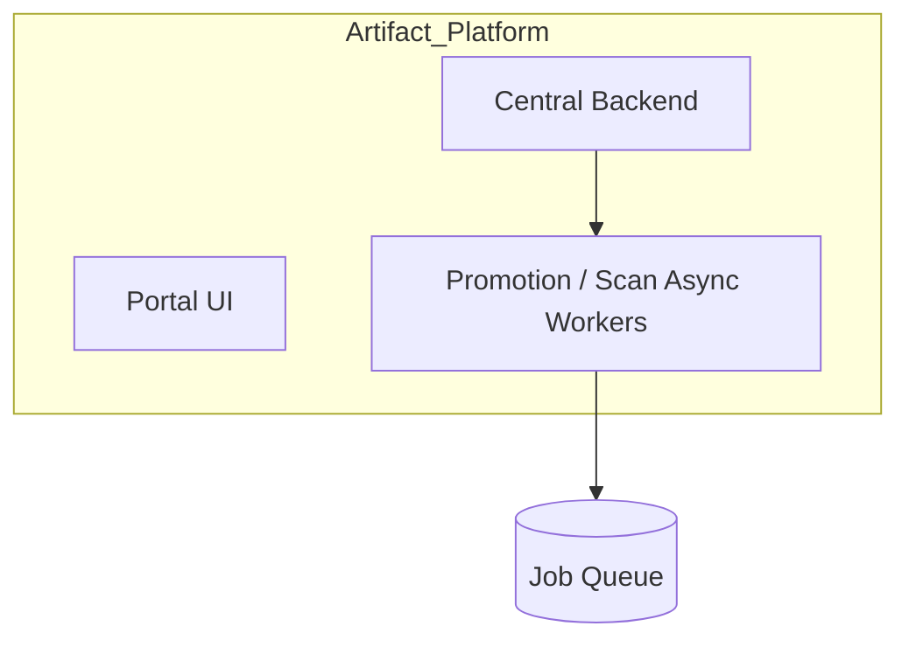
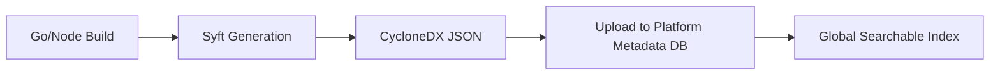

<div align="center">


<h1>Artifact Management Strategy Platform</h1>

<p><strong>Enterprise Software Supply Chain: Secure, Version, Promote, and Distribute Assets</strong></p>

[](https://devopstrio.co.uk/)
[](/terraform)
[](/security/supply-chain-security.md)
[](https://devopstrio.co.uk/)

</div>

---

## 🏛️ Executive Summary



The **Artifact Management Strategy (AMS)** platform is the definitive governor of your enterprise's Software Supply Chain. It enforces a strict, SLSA-aligned lifecycle for all Containers, NuGet packages, Python wheels, and ML models. Engineers do not deploy source code; they deploy immutable, cryptographically signed, and continuously scanned artifacts curated by this platform.

### Strategic Business Outcomes
- **Zero-Trust Supply Chain**: Integrates Sigstore/Cosign. Binaries lacking cryptographically verifiable SBOMs and signatures are isolated and blocked from entering the Production Kubernetes perimeter.
- **Automated Lifecycle Promotion**: Standardizes the "Dev → QA → Stage → Prod" pipeline via a metadata-driven Promotion Engine. No direct uploads to Production registries are permitted.
- **Shadow Repo Eradication**: Consolidates untracked Maven/NPM feeds into a single governed index, protecting corporate IP and preventing left-pad incidents via Dependency proxying.
- **FinOps Retention**: Unused integration-test artifacts are aggressively purged or shifted to Cold Storage by the Retention Engine, saving hundreds of terabytes in registry costs.

---

## 🏗️ Technical Architecture Details

### 1. High-Level Architecture
```mermaid
graph TD
    CI[GitHub Actions CI/CD] --> API[Platform API]
    API --> Reg[Registry Engine (ACR/Nexus proxy)]
    API --> Scan[Scan Engine (Trivy/Grype)]
    Scan --> DB[(Metadata DB)]
    Reg --> Prom[Promotion Engine]
    Prom --> Env[Production Registry]
```

### 2. Artifact Publish Workflow


### 3. Promotion Lifecycle (Dev to Prod)


### 4. Vulnerability Mapping & Scan Flow


### 5. Automated Retention Flow


### 6. Security Trust Boundary


### 7. Core Workload Topology (AKS)


### 8. SBOM Generation Lifecycle


---

## 🛠️ Global Platform Components

| Engine | Directory | Purpose |
|:---|:---|:---|
| **Portal UI** | `apps/portal/` | The Next.js Executive Dashboard detailing supply chain health. |
| **Platform API** | `backend/src/` | Central router governing pushes, pulls, and promotion events. |
| **Promotion Engine**| `apps/promotion-engine/`| Moves assets between logical environments contingent on approval gates. |
| **Scan Engine** | `apps/scan-engine/` | Interrogates SBOMs and containers for CVEs. |
| **Retention Engine**| `apps/retention-engine/`| Automates the cleanup of massive storage bloat. |

---

## 🚀 Environment Deployment

Provision the registry management framework.

```bash
cd bicep
az deployment sub create --name artifact-platform --location uksouth --template-file main.bicep
```

---
<sub>&copy; 2026 Devopstrio &mdash; Securing the Code that Secures the Business.</sub>
